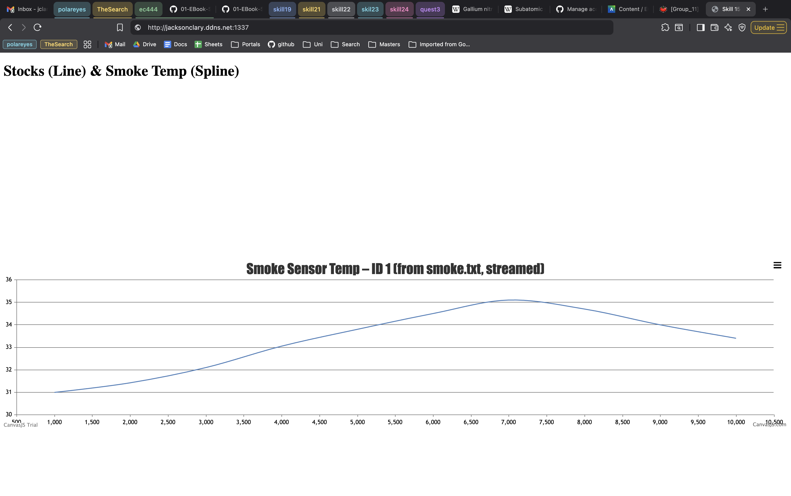
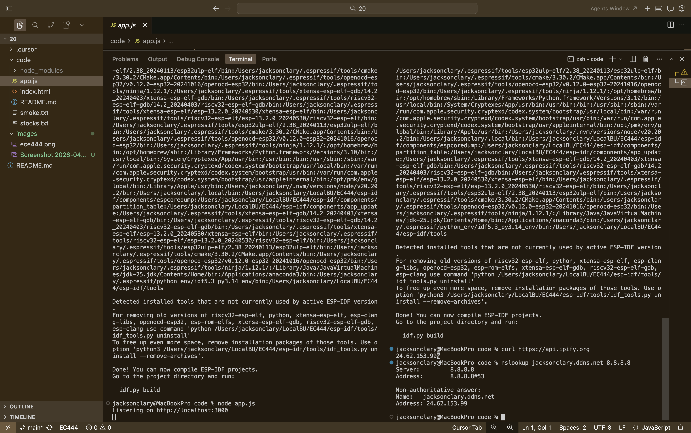

#  Dynamic DNS

Author: FirstName LastName

Date: 2026-04-13

### Summary

This skill is about setting up Dynamic DNS so you can access a server running on my router's network from anywhere on the internet using a hostname instead of some IP address that is prone to changing.

I made a free hostname on No-IP (`jacksonclary.ddns.net`) and pointed my Tomato 1.28 router at it using the built-in DDNS client. I also set up a static DHCP reservation so my laptop always grabs `192.168.1.115`. Then I set up port forwarding so external port 1337 maps to internal port 3000, which is where my Node.js server from the earlier lab is running.

On BU's campus network, my router's WAN IP is a `10.x.x.x` address. The TA's weren't able to easily help and later Claude diagnosed the problem as double NAT. To fix it as simply as possible, I took my router back to my apartment and plugged it into my personal gateway. I enabled "Bridge" mode on the gateway to my router could share the real public IP with the gateway. With that setup, the DDNS hostname resolved to my actual public IP, port 1337 forwarded cleanly to port 3000 on my laptop, and we could access the `jacksonclary.ddns.net:1337` server.

### Evidence of Completion
- Attach a photo or upload a video that captures a demonstration of
  your solution. Include in the photo/video your BU ID.

Screenshot of Web Access

Screenshot of terminal

### AI and Open Source Code Assertions

- I have documented in my code readme.md and in my code any
software that we have adopted from elsewhere
- I used AI for coding and this is documented in my code as
indicated by comments "AI generated" 

