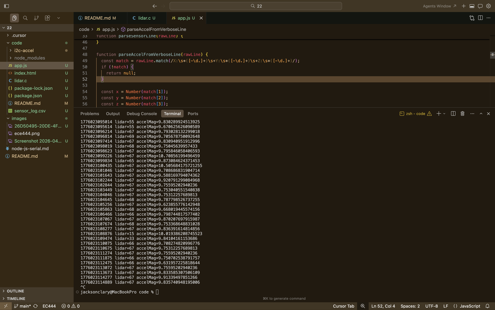

#  Node.js to CanvasJS and File

Author: Jackson Clary

Date: 2026-04-12

### Summary

This skill streams two live ESP32 sensor values (LIDAR distance and accelerometer magnitude) over UART to a Node.js app, then relays them to a browser using Socket.IO for real-time CanvasJS plotting.  
The Node app also writes each sample to a local CSV file (`code/sensor_log.csv`) with a server timestamp for persistent logging.

### Evidence of Completion

Photo Evidence

### AI and Open Source Code Assertions

- I have documented in my code readme.md and in my code any
software that we have adopted from elsewhere
- I used AI for coding and this is documented in my code as
indicated by comments "AI generated" 

### How to Run

1. Build/flash in `code/i2c-accel`.
2. In `code/`, run:
   - `npm install`
   - `SERIAL_PORT=/dev/cu.usbserial-XXXX npm start`
3. Open `http://localhost:3000`.

